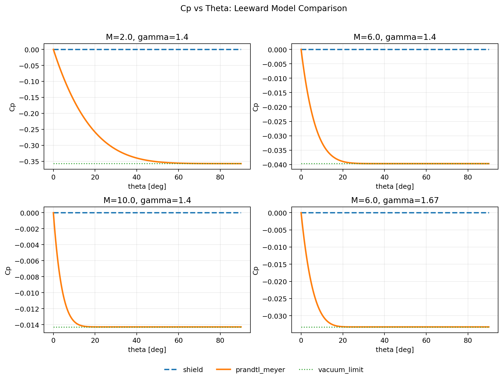

# Cp-Theta Comparison Memo (Leeward Models)

Date: 2026-02-28

## Purpose
Compare implemented leeward pressure models as a function of panel deflection angle `theta`:

- `shield`
- `prandtl_meyer`

## Reproduction
Run:

```bash
MPLBACKEND=Agg MPLCONFIGDIR=/tmp/mpl uv run python scripts/plot_cp_theta_leeward_comparison.py
```

Generated images:

- `outputs/cp_theta_leeward_models.png`
- tracked doc image: `docs/assets/cp_theta_leeward_models.png`

## Figure



## Conditions

- `(Mach, gamma) = (2.0, 1.4), (6.0, 1.4), (10.0, 1.4), (6.0, 1.67)`
- `theta = 0..90 deg`
- Leeward turning is mapped as `deltar = -theta`.

## Model Definitions

| Model | Definition (leeward) | Notes |
|---|---|---|
| `shield` | `Cp = 0` | conservative no-suction model |
| `prandtl_meyer` | isentropic expansion relation (`Cp <= 0`) | asymptotically approaches `Cp_vac = -2/(gamma M^2)` |

## Key Observations

- `shield` stays at `Cp=0` for all `theta`.
- `prandtl_meyer` gives increasingly negative `Cp` as expansion angle grows.
- At large `theta`, `prandtl_meyer` approaches the vacuum-limit line `Cp_vac`.
- Lower Mach and lower gamma produce larger-magnitude suction (`|Cp|`).
