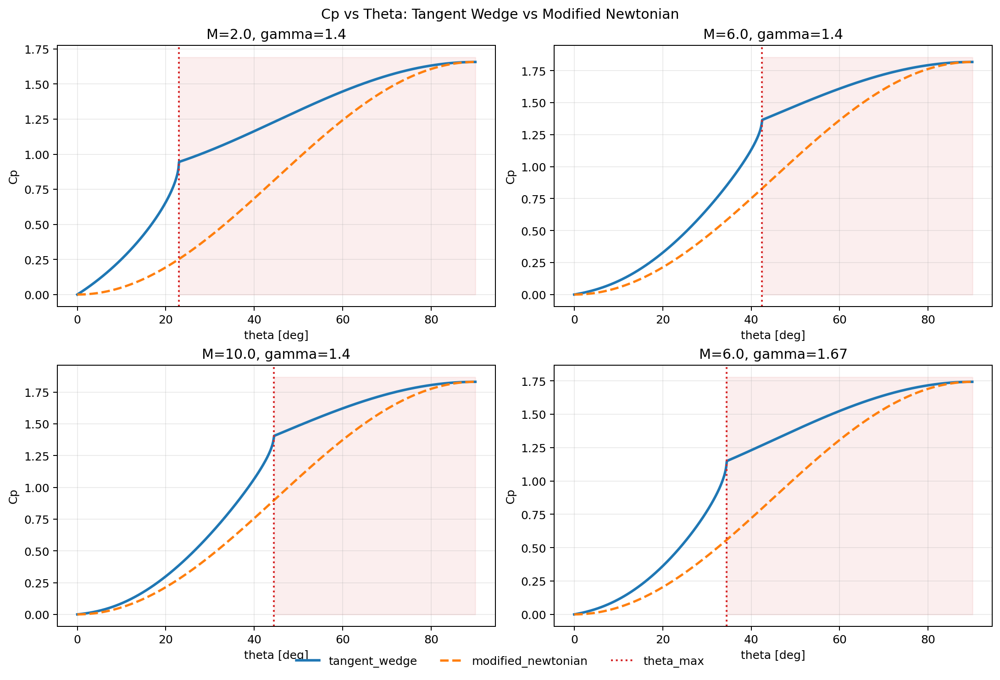

# Cp-Theta Comparison Memo

Date: 2026-02-22

## Purpose
Compare `tangent_wedge` and `modified_newtonian` windward pressure models as a function of panel deflection angle `theta`.

## Reproduction
Run:

```bash
MPLCONFIGDIR=/tmp/mpl uv run python scripts/plot_cp_theta_comparison.py
```

Output image (not tracked by git):

- `outputs/cp_theta_tangent_wedge_vs_modified_newtonian.png`
- tracked doc image: `docs/assets/cp_theta_tangent_wedge_vs_modified_newtonian.png`



## Conditions

- `(Mach, gamma) = (2.0, 1.4), (6.0, 1.4), (10.0, 1.4), (6.0, 1.67)`
- `theta = 0..90 deg`

## Current Detached Handling

- `theta <= theta_max`: tangent-wedge attached solution
- `theta > theta_max`: smooth transition from `Cp(theta_max)` to `Cp_cap` at `theta=90 deg`

## Key Observations

- In attached region, `Cp_tangent_wedge` is larger than `Cp_modified_newtonian`.
- At and beyond detach onset, `Cp_tangent_wedge` stays continuous (no drop).
- At `theta=90 deg`, both models meet at `Cp_cap`.
