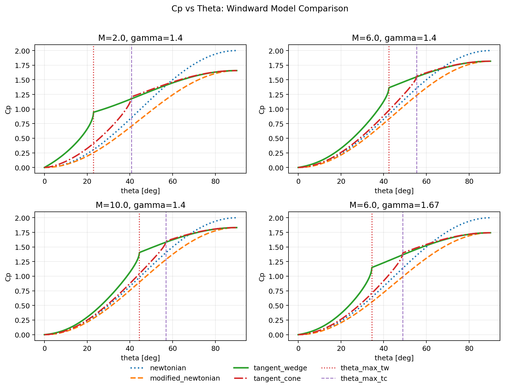

# Cp-Theta Comparison Memo (Windward Models)

Date: 2026-03-01

## Purpose
Compare all implemented windward pressure models as a function of panel deflection angle `theta`:

- `newtonian`
- `modified_newtonian`
- `tangent_wedge`
- `tangent_cone`

## Reproduction
Run:

```bash
MPLBACKEND=Agg MPLCONFIGDIR=/tmp/mpl uv run python scripts/plot_cp_theta_comparison.py
```

Generated images:

- `outputs/cp_theta_windward_models.png`
- tracked doc image: `docs/assets/cp_theta_windward_models.png`

## Figure



## Conditions

- `(Mach, gamma) = (2.0, 1.4), (6.0, 1.4), (10.0, 1.4), (6.0, 1.67)`
- `theta = 0..90 deg`
- `Cp_cap = modified_newtonian_cp_max(Mach, gamma)`

## Model Definitions

| Model | Definition (windward) | Notes |
|---|---|---|
| `newtonian` | `Cp = 2 sin^2(theta)` | classical Newtonian cap (`2.0`) |
| `modified_newtonian` | `Cp = Cp_cap sin^2(theta)` | uses normal-shock stagnation cap |
| `tangent_wedge` | oblique-shock attached solution; detached branch bridged to `Cp_cap` | `theta_max_tw` shown as red dotted line |
| `tangent_cone` | Taylor-Maccoll-based attached solution; detached branch bridged to `Cp_cap` | `theta_max_tc` shown as purple dashed line |

## Key Observations

- `newtonian` is generally the upper envelope at large `theta` because it uses fixed cap `2.0`.
- `modified_newtonian` is consistently below `newtonian` for these conditions (`Cp_cap < 2`).
- `tangent_wedge` and `tangent_cone` exceed `modified_newtonian` in attached regions.
- Both `tangent_wedge` and `tangent_cone` remain continuous through detached transition and asymptotically approach `Cp_cap` toward `theta=90 deg`.
